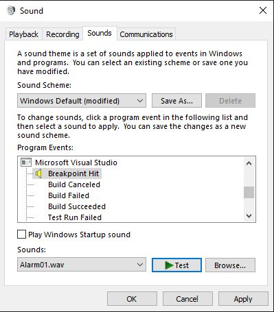

# 018 - Debugger sound #

Fun Friday topic today.

One of the most memorable sounds from Windows is the starting tune from Windows XP (or 95 depending on your age😉 - 🎶). I'm not sure how this requirement was written and who approved this, but for Visual Studio you can configure sounds for certain events happening in your IDE. This old, and mostly forgotten UI has a section for Microsoft Visual Studio, and one of the entries is "Breakpoint hit". Assigning a sound to this one would play music every time your breakpoint is hit (also works for tracepoints - bug or a feature?).

Would you use that feature?

