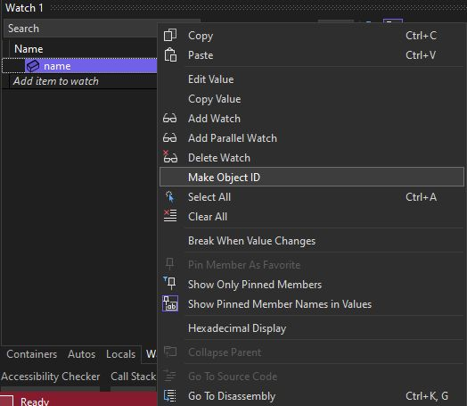
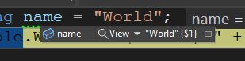

# 026 - Make Object ID #

Sometimes during debugging🔎, one needs to know if the object that we are looking at is the same as some other object that we were looking at prior. It's simple if object has some unique value that allows simply comparing this value (assuming setting the unique value is rock solid). It's not a rocket science also if we do have both objects at our sight so we can run object.ReferenceEquals on them.

What if we don't have such options? 🤔

Visual Studio's debugger provides another one. If we right click on a variable there's an option Make Object ID, it will add a special suffix (`{$1}`) to how the object is display in the watch window. It will also be visible in any places where we observe such variable. If we see a different number in another place for the variable we check, it's a different object.

See the docs 🔗: https://learn.microsoft.com/en-us/visualstudio/debugger/debugger-tips-and-tricks?view=vs-2022#to-create-an-object-id

This is how it looks in when setting up:

And this is how it's visible during debugging:

Do you use this feature during debugging? Or you have another way to tell the objects apart? If so please share.
