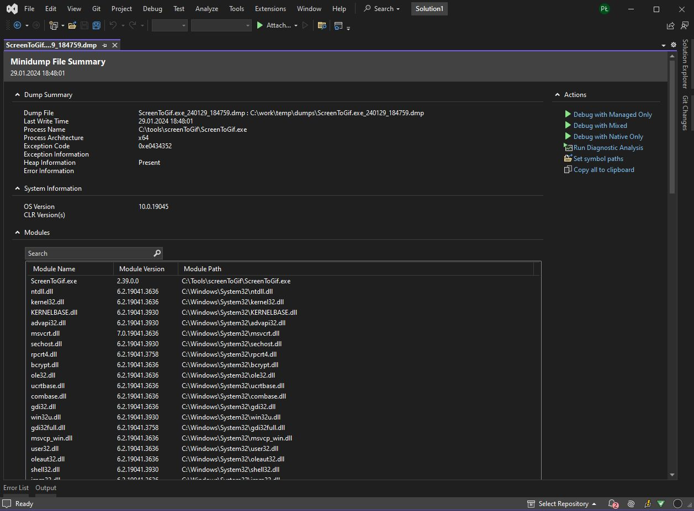
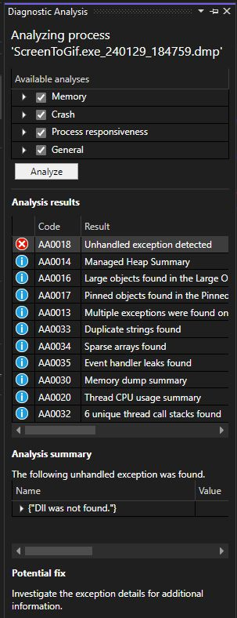

# 027 - Crash dump #

Do you know that you can use Visual Studio tooling to diagnose the problem if the only thing you have is a crash dump 💥?

Visual Studio is able to open not only projects with source code, but also a dump file that can be generated when an exception in the code occurs.

Loading such file will provide you with a summary information about the binary as well as modules that were loaded.

From this screen we can also start deeper analysis of the issue by running the `"Diagnostic Analysis"` or starting `"Debug with manged Only/Mixed/Native only"`. That last option depends on the amount of info we do have in our dump file.

With full dump we can start debugging with Managed code which is probably what we want.

This is a heavy artillery in terms of debugging capabilities but it might be needed if a bug is in other way not being able to be fixed🎯.

See the full docs here 📑: [Dump files in the Visual Studio debugger](https://learn.microsoft.com/en-us/visualstudio/debugger/using-dump-files?view=vs-2022)

Entry screen when loading a crash dump to Visual Studio:

Diagnostic panel:

Did you had a chance to use crash dump analysis in Visual Studio and did it help you finding the root cause? Please share your stories.