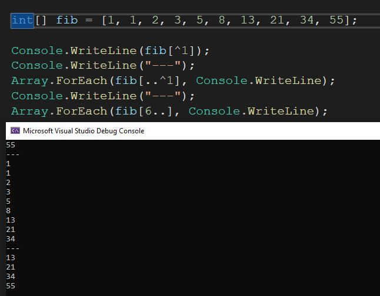

# 029 - Indexing from the end  #

A quick reminder today as I myself tend to forget about those 🐘. From some time already one can index a collection not only from the front but from the back too.

Not sure if I like the ^ operator (a minus would be better) but it's there. Just to remember that if we index from the back we need to 1-based indexing.

- 📌 list[^1] - last element from collection
- 📌 list[..^1] - all, except the last element
- 📌 list[6..] - from 7th to the end

Do you use the index from end operator? Any useful tricks with those?

See the full docs 📑: https://learn.microsoft.com/en-us/dotnet/csharp/tutorials/ranges-indexes

See the attached [code](./src/Program.cs).

