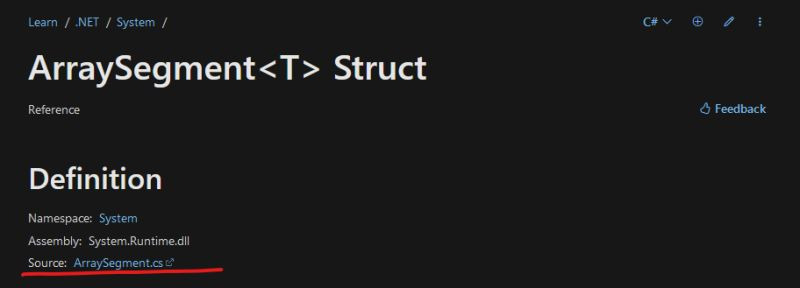

# 077 - Link to source #

I still remember having Microsoft documentation on physical media. MSDN was as essential as the tools themselves. Having the docs online allows them to be updated as needed for everyone without the need for reinstalling or downloading gigabytes of content.

Recently, such an update occurred and changes have been made. As of a few days ago, one can go directly from the documentation to the source of .NET. See the attached image.

Since the topic of documentation came up today, I would like to mention another great tool that helps with browsing the source code - [grep.app](https://grep.app). It allows searching git repositories for specific phrases instantly.

Docs 📑: https://learn.microsoft.com/en-us/dotnet/api/system.arraysegment-1?view=net-8.0

