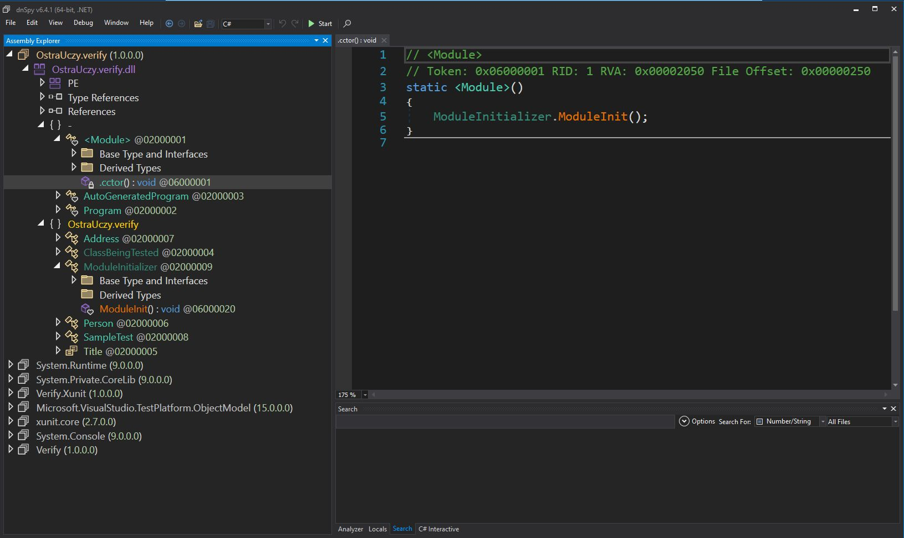

# 080 - `ModuleInitializer` #

Yesterday's post showing the usage of DontScrubGuids directly in the test was not the best example of how to use it, as it would affect the settings globally and have undesired consequences on other tests in the suite.

A better option would be to use the fluent API or the Module Initializer attribute. And that leads us to today's episode.

From the early days of .NET, there has always been an option to execute code when the module is being loaded, but it was not easily accessible. One would have to delve into IL level weaving their way through the code. ModuleInitializerAttribute makes our lives simpler.

With the introduction of this attribute, we can now (well, for some time already) write C# code that will be injected into the module initializer, and it will execute before any other code. So it's a perfect place to run any globally related settings that we need to set. The method signature, of course, has to be very limited: static, does not take any arguments, does not return anything, and is not generic.

But still, it can be useful to run some code at the very beginning of the module being loaded.

So, our updated example would be the following 👇

Docs:
- 📑 https://learn.microsoft.com/en-us/dotnet/csharp/language-reference/proposals/csharp-9.0/module-initializers
- 📑 https://github.com/VerifyTests/Verify/blob/main/docs/guids.md#globally-1

```csharp
public class SampleTest
{
    public class Sample
    {
        [Fact]
        public Task Test()
        {
            var person = ClassBeingTested.FindPerson();
            return Verify(person);
        }
    }
}

public static class ModuleInitializer
{
    [ModuleInitializer]
    internal static void ModuleInit()
    {
        VerifierSettings.DontScrubGuids();
    }
}
```

