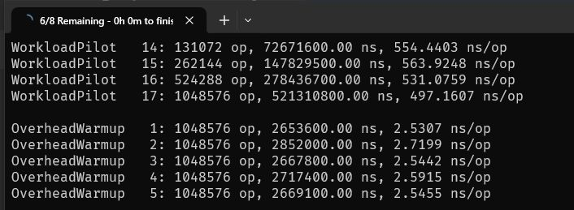

# 088 - `Console.Title` #

Being on the topic of the Console, apart from the `OutputEncoding` property, there are a bunch of other interesting properties and methods. One of them is `Title`.

It allows you to dynamically set the console window title. This unremarkable property can still be useful. I like how Benchmark.NET uses that to set the progress information about performance test execution. See the attached images 👇

Have you used that one?

Docs 📑: https://learn.microsoft.com/en-us/dotnet/api/system.console.title?view=net-8.0#system-console-title

